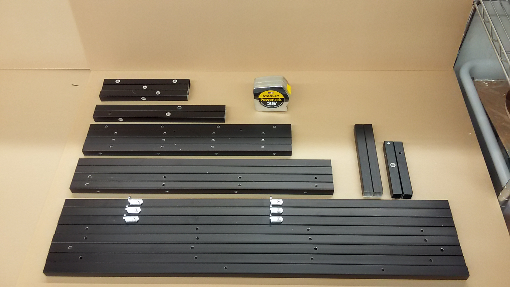
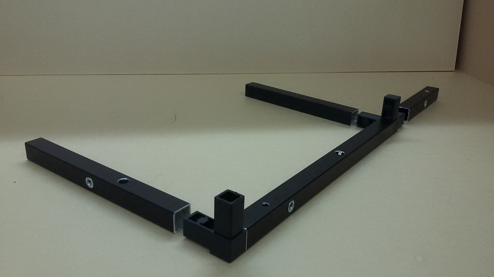
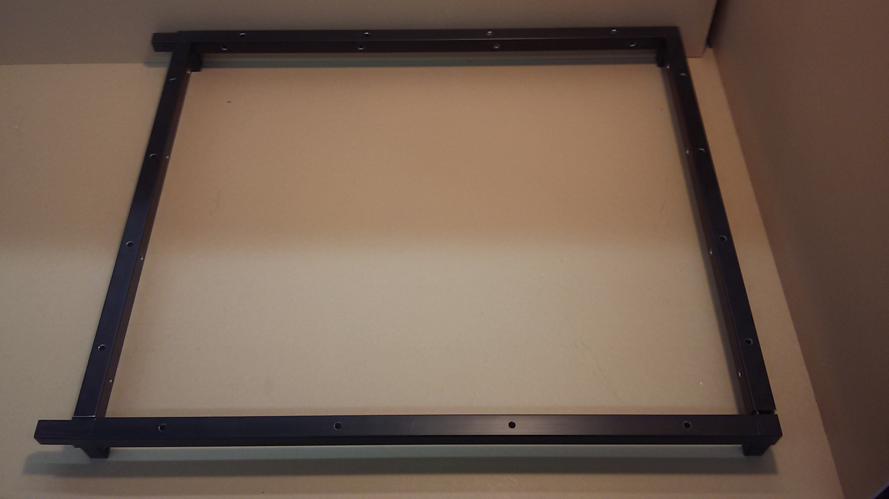

# PFC2 Build Instructions

## Assemble the Frame
![this should be a picture of the completed assembly] (photos/Testing.jpg)

### Tools
 - tape measure
 - Rubber Mallet
 - Table
 - Flat head Screwdriver
 
 
### Instructions
For 3D model Access, Go to http://www.edrawingsviewer.com/ for a free & legitmate CAD document viewing software. Then download the CAD documents from **(link)** to be viewed in e-drawings-viewer. 
  
 
 1. Check that your kit has all the proper frame bars & connectors. See **BOM-Master's STR-BAR-PCK-0001** tab for a list of bars. See **BOM-Master's "Kit Stage 1 BOM"** to find the connectors- STR-CON-0001, STR-CON-0002, STR-CON-0003.
 2.  Set the baseplate to the side for now, and group the bars by length
 
#### Base Layer
  
1. Collect the Base Layer Components:
  * x2 of STR-BAR-0001
  * x1 of STR-BAR-0003
  * x1 of STR-BAR-0004
  * x1 of STR-BAR-0005
  * x1 of STR-BAR-0006
  * x1 of STR-BAR-0007
  * x1 of STR-BAR-0008
  * x4 of STR-CON-0001
  * x3 of STR-CON-0002
  * x2 of STR-CON-0003

2. In x1 **STR-BAR-0001** bar, Insert x2 of **STR-CON-0001**. In The other **STR-BAR-0001**, insert x1 **STR-CON-0001** and x1 **STR-CON-0002**. Wider hole spacing should be through the vertical surface, as shown. These bars run along the bottom side of the grow chamber.

3. Lay down one **STR-BAR-0003** in back, and one **STR-BAR-0008** in front. The wider hole spacing on **STR-BAR-0003** should be on the vertical surface. Make sure the 4-way connnector STR-CON-0002 is in the far left corner. Some *light* force may be required here. Set This Assembly to the side

 
4. Gather x1 of: **STR-BAR-0004**, **STR-BAR-0005**, **STR-BAR-0006**, **STR-BAR-0007**.
5. Connect x1 of **STR-CON-0001**  and x1 of **STR-CON-0002** into **STR-BAR-0005**, in orientation shown below. 
6. Connect **STR-BAR-0004** onto the 3-way connector, wider hole spacing vertical on the vertical surface, **STR-BAR-0007** perpendicular on the 4-way connector, and **STR-BAR-0006** parallel, with holes oriented as shown. 

7. Insert x1 **STR-CON-0003** into the end of **STR-BAR-0007** & **STR-BAR-0006**. 
8. Double check all bar orientations, then attach the two assemblies together. 

#### Top Layer

1. In x1 **STR-BAR-0001** bar, Insert x2 of **STR-CON-0001**. In The other **STR-BAR-0001**, insert x2 **STR-CON-0002** and x1 **STR-CON-0002**. Wider hole spacing should be through the vertical surface, as shown. These bars run along the top side of the grow chamber.

2. Lay down one **STR-BAR-0003** in back, and one **STR-BAR-0008** in front. Again, the wider hole spacing on **STR-BAR-0003** should be Through the verical surface. Some *light* force may be necessary here.

3. Gather x2 of **STR-BAR-0004**, x1 of **STR-BAR-0005**, x1 of **STR-BAR-0006**, x1 of **STR-BAR-0007**, x2 of **STR-CON-0001**, x1 of **STR-CON-0002**, x1 of **STR-CON-0003**.
4. Connect x1 **STR-CON-0001**  and x1 **STR-CON-0002** into **STR-BAR-0005**, in orientation shown. 
5. Connect **STR-BAR-0004** onto the 3-way connector with holes oriented as shown, **STR-BAR-0007** perpendicular on the 4-way connector, and **STR-BAR-0006** parallel, with holes oriented as shown. ![Pic]
6. Inert x1 **STR-CON-0003** in the end of **STR-BAR-0007** with the exposed end downward, x1 **STR-CON-0001** similarly into **STR-BAR-0006**. 
7. Connect the final **STR-BAR-0004** horizontally on the 3 way connector. Centered thread through the outer vertical surface.

8. Put last connectors in *(is this step needed)*
9. check orientations, attach halves.

### Mounting Vertical Members
1. There are three vertical members: **STR-BAR-0002**, **STR-BAR-0009** & **STR-BAR-0010**
 * Refering to **BOM-Master's STR-BAR-PCK-0001**, 
  * **STR-BAR-0010** has L-brackets attached to it, with two larger holes on the bottom. 
  * **STR-BAR-0009** has 10 holes, including Threads for the door attachement
  * **STR-BAR-0002** has 16 holes, and stands in the Rear of the growing chamber. 
2. Attach all **STR-BAR-0010** to the Electronics Box side- the smaller bottom half. 
3. Attach both **STR-BAR-0002** to the back two connectors of the growing chamber, wider hole spacing towar back. 
4. attach both **STR-BAR-0009** to the front two connectors, threaded holes facing outward. 

*Wait! do not put the top half on. First, Assemble the Electronics Panel*

## Mount Frame to Base Plate

### Tools
- 1/4" flathead Screwdriver

## Assemble the Inner Side Panel

## Assemle the Light Panel

## Assemble the Brain Module (PFC2-MOD-0001)
 
### Tools
 - Small Flathead Screwdriver
 - Medium Phillips Screwdriver
 - Standard Hex Driver Set
  
### Instructions
 1. Gather materials for this submodule. See BOM-Master's PFC2-MOD-0001 tab
 2. Peel off the protective covering on both sides of the **Brain Manifold Panel** & **Raspberry Pi Mounting Panel**
 3. Attach x8 of the **8-32 x 1" Aluminum Standoffs** (S-#08-32-100-STD-H-AL-FF) to the Brain Manifold Panel with x8 of the **8-32 x 1/2" Button Head Screws** (S-#08-32-050-BTN-S-SS) as shown in 
 4. Attach an **8-Pos Barrier Block Jumper** (PWR-BUS-0002) to a single side of the **8-Pos Barrier Block** (PWR-BUS-0001). Attach the jumper to all x4 blocks.
 5. Mount x4 of the **8-Pos Barrier Blocks** to the **Brain Manifold Panel** with x16 of the **4-40 x 1/2" Button Head Screws** (S-#04-40-050-BTN-S-SS) and x16 of the **4-40 Nuts** (S-#04-40-094-NUT-H-SS) as shown in ![brain_panel_barrier_blocks] (photos/brain_panel_barrier_blocks.JPG)
 6. Mount the **16-Channel Relay Board** (ELC-REL-0001) to the **Brain Manifold Panel** with x4 of the **4-40 x 1/4" Body Aluminum Standoff 3/16" Length, Male-to-Female** (S-#04-40-025-STD-H-AL-MF), x4 of the **4-40 x 3/4" Aluminum Standoff Female-to-Female** (S-#04-40-075-STD-H-AL-FF), and x4 of the **4-40 x 1/4" Button Head Screw** (S-#04-40-025-BTN-S-SS)
 7. Mount the **Raspberry Pi 3 Model B** (ELC-PRC-0002) to the **Raspberry Pi Mounting Plate** (STR-PNL-0015) with x4 of the **4-40 x 1/8" Button Head Screws** (S-#04-40-125-BTN-S-SS), x4 of the **4-40 x 1/4" Nylon Standoff** (S-#04-40-025-STD-H-NY-FF), and x4 of the **4-40 x 1/4" Button Head Screw** (S-#04-40-025-BTN-S-SS)
 8. Mount this panel on top of the **16-Channel Relay Board** with x4 of the **4-40 x 1/4" Button Head Screw** (S-#04-40-025-BTN-S-SS). The assembly should now look like ![brain_panel_relay_pi] (photos/brain_panel_relay_pi.JPG)
 
 
## Assemble the Power Module

## Assemble the Water Manifold

## Assemble the Pump Module

## Assemble the Back Panel

## Assemble the Side Panel

## Assemble the Chamber Fan & Heater Module
